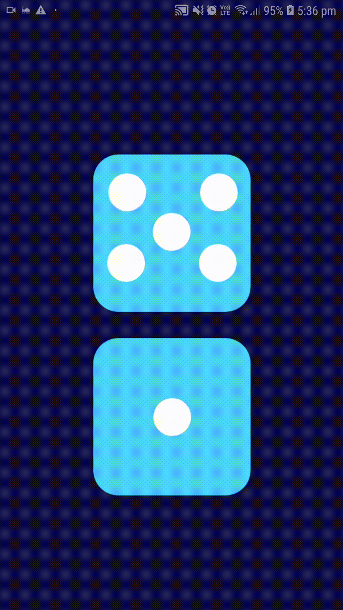

# DiceRoller

Build using React native. 
As the name suggests, this app gives you random outputs of a dice which can be usefull while playing any dice games.

Provides you two dice, one for each user in a 2 player game.

How to use the app:

1. Install the apk of the app onto your mobile device.
2. Generate random dice values by tapping on any of the two dice.

